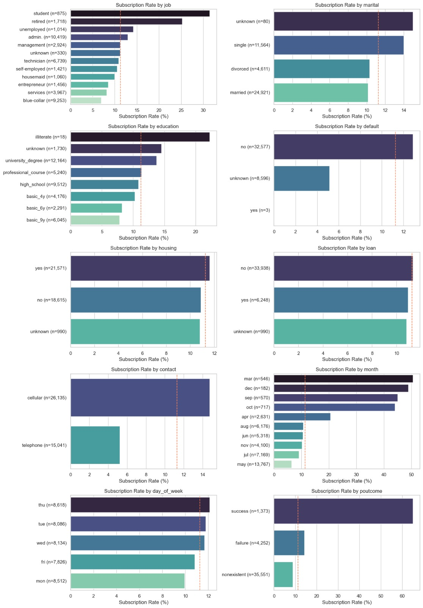
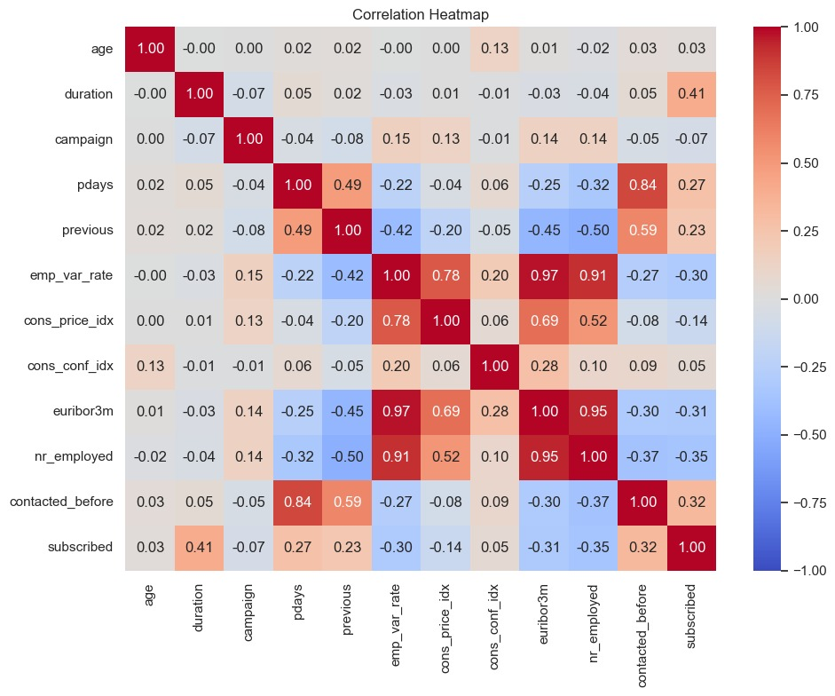
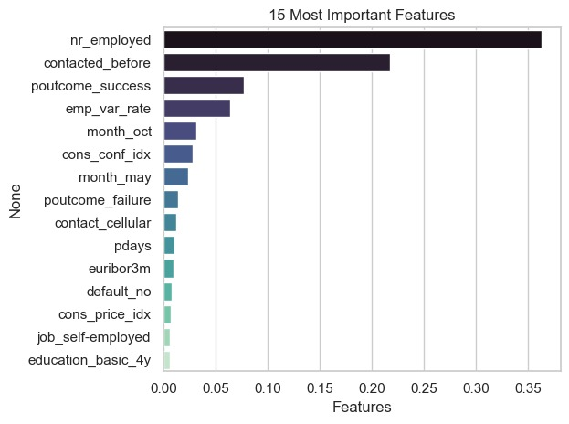

# Predicting Bank Term-Deposit Subscriptions

A machine learning project in Python that ranks bank clients by how likely they are to say yes to a term-deposit offer, so a marketing team can call the most promising clients first.

**Stack:** Python · pandas · NumPy · seaborn · matplotlib · scikit-learn · XGBoost
**Notebook:** [`Bank_Marketing_Model.ipynb`](Bank_Marketing_Model.ipynb)

---

## Summary

A Portuguese bank phoned clients to sell term deposits, and only about 1 in 9 said yes. I cleaned the data, explored what separates subscribers from non-subscribers, and compared three tree-based classifiers. The final model is a tuned XGBoost trained **without** the call-duration column, because call length is only known after the call ends and would leak the answer.

| | |
|---|---|
| **Goal** | Predict whether a client subscribes to a term deposit |
| **Data** | 41,188 call records, 20 input columns (41,176 rows after removing 12 duplicates) |
| **Challenge** | Imbalanced classes: only 11.3% of clients said yes |
| **Final model** | Tuned XGBoost, no `duration` column |
| **Test results** | PR-AUC **0.485** (random guessing ≈ 0.113) · ROC-AUC **0.812** |
| **Business value** | Calling the top 20% of clients ranked by the model reaches **67%** of all subscribers (3.3x better than calling at random) |

---

## Key findings

1. **A past campaign success is the strongest client-level signal.** Clients whose previous campaign outcome was a success subscribed 65.1% of the time (n = 1,373), versus 14.2% after a failure and 8.8% for clients never contacted before.
2. **The economy at the time of the call matters a great deal.** Subscribers were reached when interest rates and employment levels were lower (average 3-month Euribor of 2.12 for subscribers vs 3.81 for non-subscribers). The five economic columns make up about 47% of the final model's feature importance.
3. **Age has a U-shape that correlation misses.** Its linear correlation with subscribing is only 0.03, yet clients aged 65+ subscribed 46.9% of the time (n = 618) and those under 25 subscribed 21.0%, against 8.5-8.7% for ages 35-55.
4. **Cellular calls convert far better than landline calls:** 14.7% vs 5.2%.
5. **Seasonality is dramatic, but volume matters.** May carried a third of all calls (13,767) at the lowest rate (6.4%). March, September, October and December had few calls (182-717) but rates of 44-51%. Low-volume months give less stable rates, and the data does not explain the gap.
6. **Students (31.4%) and retirees (25.3%)** subscribe far more often than blue-collar workers (6.9%).
7. **More calls, lower success:** 13.0% after one call, falling to 3.6% for clients called 10 or more times.
8. **Call duration is a leakage trap.** Subscribers' calls averaged 553 seconds versus 221 for non-subscribers, and `duration` has the strongest correlation with the target (0.41). But it is unknown until the call is over, so it can't be used to decide whom to call.

---

## Data

- **Source:** Bank Marketing dataset (`bank-additional-full.csv`) by Moro, Cortez and Rita (2014), phone marketing campaigns of a Portuguese bank. I used the Kaggle copy [`dvaser/bank-marketing`](https://www.kaggle.com/datasets/dvaser/bank-marketing).
- **Size:** 41,188 rows × 21 columns, semicolon-separated.

| Group | Columns |
|---|---|
| Client | `age`, `job`, `marital`, `education`, `default`, `housing`, `loan` |
| Last contact | `contact`, `month`, `day_of_week`, `duration` |
| Contact history | `campaign`, `pdays`, `previous`, `poutcome` |
| Economy at the time of the call | `emp_var_rate`, `cons_price_idx`, `cons_conf_idx`, `euribor3m`, `nr_employed` |
| Target | `y` (renamed `subscribed`, mapped to 0/1) |

**Data quality**

- No missing cells, but six columns use the text `unknown` as a hidden missing value:

| Column | Unknown rows | Share |
|---|---|---|
| `default` | 8,596 | 20.9% |
| `education` | 1,730 | 4.2% |
| `housing` | 990 | 2.4% |
| `loan` | 990 | 2.4% |
| `job` | 330 | 0.8% |
| `marital` | 80 | 0.2% |

- 12 exact duplicate rows (removed).
- `pdays` uses 999 as a placeholder for "never contacted".

---

## Data preparation decisions

| Decision | Why |
|---|---|
| Removed 12 duplicate rows | There is no customer ID, but these rows match on all 21 columns. If one copy lands in training and its twin in the test set, the model is scored on a row it has already seen. |
| Kept `unknown` as its own category | It carries information: clients with `default = unknown` subscribed at 5.2%, versus 12.9% for `no`. Dropping rows would have removed at least 20.9% of the data (`default` alone), and dropping the column would have discarded the signal. |
| Replaced the `pdays` placeholder (999) with a `contacted_before` flag and set `pdays` to 0 | Left as 999, the model would read "never contacted" as "a very long time ago". The flag keeps the two cases separate. About 1,500 clients (3.7%) had been contacted before. |
| **Dropped `duration`** | Call length is only known after the call, so using it to predict the outcome is leakage. |
| One-hot encoded all categorical columns, keeping every level | For tree models, keeping every level lets a tree isolate a category in one split. |
| No scaling, outlier removal or log transforms | Tree models split on thresholds, so skewed columns (`duration`, `campaign`) and extreme values don't hurt them. |
| Stratified 80/20 split (32,940 train / 8,236 test, `random_state=42`) | Stratification keeps the 11.3% yes rate the same in both sets. |

---

## Exploratory analysis

**Subscription rate by category** (overall rate: 11.3%)

| Feature | Highest | Lowest | Notes |
|---|---|---|---|
| `poutcome` | success 65.1% (n=1,373) | nonexistent 8.8% (n=35,551) | Strongest category effect |
| `contact` | cellular 14.7% | telephone 5.2% | |
| `job` | student 31.4% (n=875), retired 25.3% | blue-collar 6.9% (n=9,253) | |
| `education` | university degree 13.7% | basic.9y 7.8% | Rate rises with education level |
| `default` | no 12.9% | unknown 5.2% | Only 3 clients are `yes` |
| `marital` | single 14.0% | married 10.2% | Small gap |
| `housing`, `loan`, `day_of_week` | | | Little signal (about 10-12% everywhere) |

"Highest" and "lowest" exclude `unknown` categories and very small groups. Rates for tiny groups (`illiterate` n=18, `marital = unknown` n=80) look striking but are noise, so I did not interpret them.



**Age** (U-shaped)

| Age group | Subscription rate | Clients |
|---|---|---|
| 17-25 | 21.0% | 1,665 |
| 26-35 | 11.7% | 14,844 |
| 36-45 | 8.5% | 12,839 |
| 46-55 | 8.7% | 8,247 |
| 56-65 | 15.2% | 2,963 |
| 66+ | 46.9% | 618 |

**Number of calls (`campaign`, capped at 10):** 13.0% (1 call) → 11.5% → 10.7% → 9.4% → 7.5% → 7.7% → 6.0% → 4.3% → 6.0% → 3.6% (10+ calls).

**Correlations**

- The economy columns are almost duplicates of each other: `emp_var_rate`, `euribor3m` and `nr_employed` correlate at 0.91-0.97, and `cons_price_idx` with `emp_var_rate` at 0.78. They all measure the state of the economy at the time of the call. Tree models are unaffected, but they share feature importance.
- Correlation with subscribing: `duration` 0.41, `nr_employed` -0.35, `contacted_before` 0.32, `euribor3m` -0.31, `emp_var_rate` -0.30, `pdays` 0.27, `previous` 0.23.



**Distributions:** `duration` and `campaign` have long right tails (99th percentile of `campaign` is 14, maximum 56). `previous` is 0 for nearly everyone.

---

## Modelling

**Metric choice.** With 11.3% positives, accuracy is misleading: always predicting "no" scores 88.7%. For the formal comparison I used **PR-AUC** (how well the model ranks likely subscribers) and ROC-AUC under stratified 5-fold cross-validation on the training set.

**First look (exploratory).** Out of curiosity, I first fitted all three models and scored them on the held-out test set. The Decision Tree and Random Forest used balanced class weights, and XGBoost used `scale_pos_weight` ≈ 7.9.

| Model | "Yes" precision | "Yes" recall | "Yes" F1 | ROC-AUC |
|---|---|---|---|---|
| Decision Tree | 0.39 | 0.62 | 0.48 | 0.79 |
| Random Forest | 0.40 | 0.64 | 0.49 | 0.81 |
| XGBoost | 0.38 | 0.66 | 0.48 | 0.81 |

All three caught most subscribers (recall 0.62-0.66) at the cost of many false alarms (precision 0.38-0.40). The model comparison, tuning and final choice then relied on cross-validation on the training set.

**Model comparison** (5-fold CV on the training set)

| Model | PR-AUC | ROC-AUC |
|---|---|---|
| Decision Tree (depth 4, balanced class weights) | 0.385 ± 0.005 | 0.774 |
| Random Forest (300 trees, depth 8, balanced class weights) | 0.460 ± 0.017 | 0.797 |
| XGBoost (`scale_pos_weight` ≈ 7.9) | 0.465 ± 0.015 | 0.799 |

The Decision Tree is clearly behind. Random Forest and XGBoost are statistically tied, since their gap (0.005) is smaller than the fold-to-fold spread. I chose XGBoost, which tied for the best score and offered more settings to tune.

**Tuning.** Grid search over `max_depth` [3, 5, 7], `n_estimators` [200, 400], `learning_rate` [0.05, 0.1] and `scale_pos_weight` [1, 3, 7.88] (36 combinations, 5-fold CV, scored on PR-AUC).
Best: `max_depth=3`, `n_estimators=200`, `learning_rate=0.1`, `scale_pos_weight=1`, with a CV PR-AUC of **0.466**.

Two things this shows:

- **Tuning added almost nothing** (0.465 → 0.466). Performance is limited by the information in the columns, not by the model settings.
- **Class weighting didn't help ranking.** `scale_pos_weight=1` won, likely because PR-AUC measures ranking quality, while weighting mostly just moves the yes/no cutoff.

**Final test-set results** (tuned XGBoost)

| Metric | Value |
|---|---|
| PR-AUC | **0.485** (CV: 0.466) |
| ROC-AUC | **0.812** |
| Accuracy | 0.90 (always-"no" baseline: 0.887) |
| "Yes" class, default 0.5 cutoff | precision 0.64 · recall 0.23 · F1 0.33 |

The test score is close to the cross-validation score, which suggests no overfitting. At the default 0.5 cutoff the model is conservative, flagging few clients but being right most of the time. Because its value is in *ranking* clients, the lift table below is the more relevant view, and the cutoff can be lowered to trade precision for recall.

### Test business impact: ranking clients by predicted probability

Test set: 8,236 clients, 928 of whom subscribed (11.3%).

| Call the top... | ...reach this share of subscribers | Lift vs random calling |
|---|---|---|
| 10% of clients | 46% | 4.6x |
| 20% | 67% | 3.3x |
| 30% | 74% | 2.5x |
| 50% | 84% | 1.7x |

---

## What drives the predictions

Top features of the final model (without `duration`):

| Feature | Importance |
|---|---|
| `nr_employed` | 36.3% |
| `contacted_before` | 21.8% |
| `poutcome_success` | 7.7% |
| `emp_var_rate` | 6.4% |
| `month_oct` | 3.1% |
| `cons_conf_idx` | 2.8% |
| `month_may` | 2.4% |
| `poutcome_failure` | 1.4% |
| `contact_cellular` | 1.2% |
| `pdays` | 1.1% |

- The five economic columns together account for about 47% of importance, and the prior-contact features (`contacted_before`, `poutcome_*`, `pdays`) for at least 32%.
- Importance shows how much the model *used* a feature, not which direction it pushes. The direction comes from the group tables above.
- The correlated economic columns share credit, so individual ranks among them shouldn't be over-read. Categorical columns such as `month` and `job` look weaker than they are because their importance is split across many dummy columns.



---

## Limitations

- **Associations, not causes.** For example, students subscribing more does not mean being a student causes a yes: age, prior contact and the economy overlap with job.
- **The model may partly learn *when* a call happened.** The economic indicators take the same value for everyone called in the same period, so they can act as a proxy for the campaign period. The train/test split is random and was not tested on later time periods, so how well the scores hold for a future campaign is unverified.
- **Small groups** (`illiterate`, `marital = unknown`, `default = yes`) are too small to interpret.
- **One bank.** The data comes from the phone campaigns of a single Portuguese bank, so the patterns may not transfer to other banks or economic conditions.
- **Moderate absolute performance.** At the default cutoff the tuned model catches only 23% of subscribers, while the weighted models in the first look caught 62-66% but with precision of only 0.38-0.40. Catching more subscribers means accepting more wasted calls.

---

## Reproduce

```bash
git clone https://github.com/louischidebe/bank-term-deposit-prediction.git
cd bank-term-deposit-prediction
pip install pandas numpy seaborn matplotlib scikit-learn xgboost jupyter

# Download the dataset from Kaggle and update the file path
# in the notebook's data-loading cell.
jupyter notebook Bank_Marketing_Model.ipynb
```

**Repository structure**

```
bank-term-deposit-prediction/
│
├── images/
│   ├── correlation_heatmap.jpeg
│   ├── subscription_rate_by_category.jpeg
│   └── feature_importance.jpeg
│
├── Bank_Marketing_Model.ipynb
└── README.md
```

## Credits

Moro, S., Cortez, P. and Rita, P. (2014). *A Data-Driven Approach to Predict the Success of Bank Telemarketing.* Decision Support Systems, 2014.
